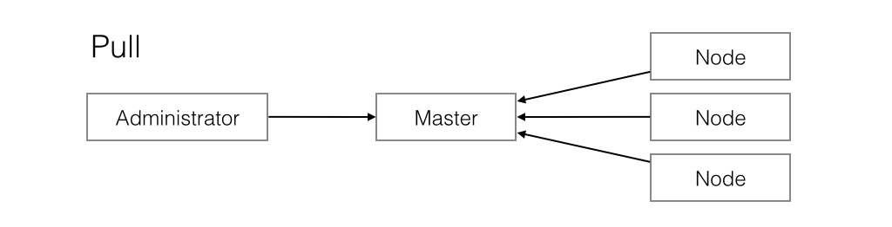
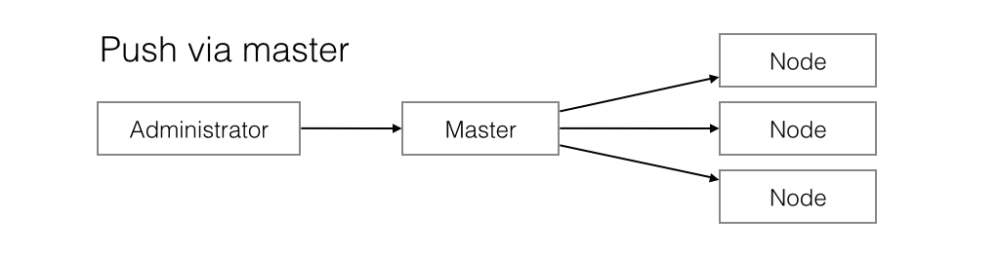
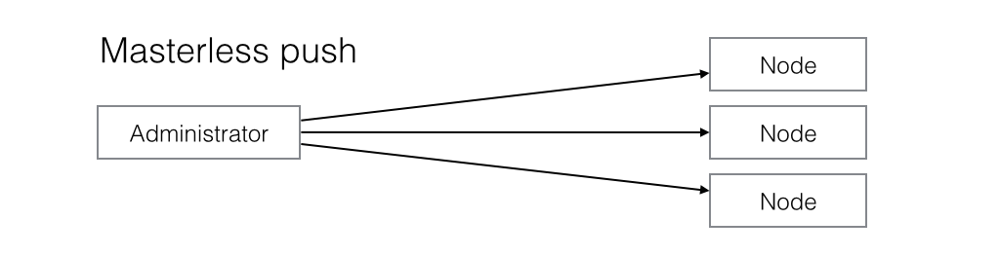

# Choosing a provisioning framework

So, you have decided that your infrastructure needs automatic provisioning. But which framework should you go for? If you are new to the world of provisioning, it might be hard to know what to look for in a good framework. Here are some considerations you might want to make before you make your final decision.

There are many good provisioning frameworks out there. Among the most mature ones at the moment are [Chef](https://www.chef.io/chef), [Ansible](http://www.ansible.com), [Salt](http://docs.saltstack.com/en/latest/), and [Puppet](http://puppetlabs.com). And there might very well be others worth considering too. So, how do you differentiate between them?

## Two aspects

As we see it, there are two main aspects to consider when evaluating a provisioning framework. 


> Bilde av to-delingen her.

First we have the part you interact with directly, the DSL. And secondly there is the tool itself, the part which converts what you have described using the DSL into actual infrastructure on your servers.

Lets start by considering the latter.

## The model

When considering the tool, we are actually considering which model is the right one.

There are basically three different models to choose between: *pull*, *push via master*, and *masterless push*. Your specific needs will determine which model is right for you, and in turn which framework you should consider using.

### The pull model



If you need your provisioning to really be able to scale, you probably want the pull model. Here the developer uploads the latest changes in configuration to the master provisioning node, which then simply stores it. It is the responsibility of each of your other servers to pull the master regulary and apply any updates. The drawbacks are that you don't control when provisioning is done, and you need an agent pre-installed on the nodes.

Currently pull is supported by Puppet and Ansible.


### The push model



A disadvantage of the pull model is that you lose some control of when the changes are applied to your servers. To rectify this, move to a push based model. To still keep a relatively high scalabilty we can keep the master node, and let it push changes to all nodes. This way we get changes out to all servers immediately, and can control the order of things if we wish.

Both Salt and Chef supports push via master.


### The masterless push model



If you don't need high scalability, you might be able to get rid of the master node altogether. This simplifies the model, and allows you to apply changes to your servers directly from your local machine. This might be best suited for smaller teams, as there is no longer a master mediate changes, and two people provisioning at the same time might cause trouble.

Note that even with the masterless push model, you might vant to keep a dedicated server to provide a stable environment for initiating the provisioning of your production servers.

Among the frameworks we considered only Ansible supported masterless push.


Note that you might also want to mix models. Some people, for instance, use Puppet with pull to manage the infrastructure and use Ansible with push for application deployment.

## The DSL

After determining which model is right for you, you still have to find the best framework supporting this model. Looking at the DSL, there are some questions you should be asking.

- **Is it idempotent?**
  You will want to describe your structure in a declarative way. 
- **How readable is it?**
- **Which abstractions does it provide?**
- **Does it separate your data from your logic?**

## Conclusions

Which provisioning framework should you choose? The answer is, as always, *it depends*. We have presented some of the major points on which you should judge each famework, but it's up to you to make a decision suited to your needs. Remember to consider the model you'll need before looking at the DSL, as the model is most likely to be a constraint.

This article has, quite possibly, left you even more unsure about which framework to choose. But at least now you know which questions to ask.


&nbsp;

&nbsp;

<hr>


## How is the DSL?

The next thing you should concern yourself with is the DSL, or Domain Specific Language, of the framework. This is the langauge you'll be using to specify your infrasctructure, and there are several traits you should be looking for.

> TODO: bør skrive noe om hvordan de ulike rammeverkene står i avsnittene under. Er alle like lesbare, har alle abstraksjoner for alt, etc?

### Idempotence

You really want your DSL to be [idempotent](http://en.wikipedia.org/wiki/Idempotence), which is just a fancy way of saying that it should do the same thing no matter how many times you run it. 

This is the reason implementing something like this from scratch is a bad idea. If you need to install some package on your servers you don't want the provisioning to fail the second time you run it just because the package is already installed, and you *really* don't want to be writing checks and guards all over the place to avoid that happening. The DSL should handle all of this effortlessly.

### Readablility

When you set up automatic provisioning of your servers, what you're really doing is creating a specific documentation over all your servers and environments as code. The easier the DSL is to read, the better your overview is, and less time is wasted checking things.

This is especially important in a large organization where a lot of different people need to read and understand the code, or in a setting where you frequently need to train new people.

In the ideal case, the DSL should be so obvious that even non-technical people get something out of reading it.

### Abstractions

Make sure the framework you choose have abstracted away things you don't want to deal with.

To give an example, you probably want to set up some users on your servers, but you don't want to specify the steps for doing so. All you want is to say something about usernames, groups, perhaps which shell they prefer, but not the exact commands to invoke.

Sometimes you'll probably have to resort to listing some exact command lines to execute, but a good DSL will have predefined tasks for most of the things you need to do.

One of the most important abstractions is the ability to detect state changes in e.g. configuration files and deciding what to do based on that. You shouldn´t restart services "just in case". That is, you want something like the following:

> if _X_ has _changed_, _reload_ service _Y_

## Does it separate your data from your logic?

> TODO: Denne delen trenger nok et kode-eksempel. Og vi trenger å skrive noe om hvordan de ulike rammeverkene støtter denne typen skille mellom kode og data.

*Infrastructure as code* has long been a mantra in the world of provisioning. A newer trend, taking this one step further, is the idea of *infrastructure as data*. 

Infrastructure as code is all about making sure all those manual steps used to set up a server is preserved as automated, repeatable, code. In this next step of evolution, we view the specification of the configuration as a dataset. It is the job of the logic of the framework to understand this specification and realize it.

To people coming from a developer background this might sound obvious. It should be natural to *separate the data from your logic*, and there are of course several benefits to doing so. Your data are expected to live longer than your logic, and are in most cases more valuable.

With infrastructure as code you would write code like the following (pseudo code):
```yml
- create user "Olav" with password "abc"
- create user "Helga" with password "123"
- create user "Nils" with password "123abc"
```

but with infrastructure as data you would instead write single task just referring to a data structure.
```yml
- create user "{{name}}" with password "{{password}}"
  for each user in {{users}}
  
users:
- name: Olav
  password: abc
- name: Helga
  password: 123
- name: Nils
  password: 123abc
```

This way you don't have to update your code just because some server needs an additional user or an nginx proxy configured.

### Readabilty

We mentioned readability as one of the properties you would want your DSL to have. But lets face it, no matter how pretty a DSL it can't beat pure data.

### Reuse of logic

When the logic is no longer tied to a specific set of values, you might be able to better reuse it. You know that code you were planning to write to set up a reverse proxy? Now you can reuse it when you need a different proxy. You save time, and your code stay DRY.

### Reuse of data

Consider the question: What would happen if you initially make the wrong decision, or your requirements change, and you need to switch to a new provisioning model?

Well, you'll obviously have to do some work over, but how much will you be able to salvage?

The different **configuration files** is the easiest. These are typically pure text files just copied as-is by the framework. Your next framework will do just the same.

Your **file templates** are a bit less trivial. These are massaged using some template engine or another, and if your next framework uses another tempelating system, you will have to change them. This should fortunately not be too much work in most cases. And besides, some frameworks use the same templates, e.g. both Ansible and Salt uses Jinja.

The most problematic case is the **provisioning tasks** themselves. Your next framework will most certainly use a different DSL, which will render your logic useless. The way to mitigate this is to separate your data from your tasks as much as possible, and put them into some clean **data structures**. Most of the provisioning world has standarized on [YML](http://en.wikipedia.org/wiki/YAML), which makes reusing your data structures relatively simple.

The ratio of effort spent on **configuration files**, **file templates** and **data structures** vs **provisioning tasks** is also a good indication of how good a framework is. Provisioning tasks are merely plumbing, and should not be the main focus.

## Does it facilitate reuse of third party components?

Besides reusing your own logic (and data), it's nice to be able to reuse components others have written. Unless your needs are very specific, there's a good chance someone have already done the work for you.

Frameworks usually offer some way to modularize your provisioning setup, such as Ansible [roles](http://docs.ansible.com/playbooks_roles.html#roles) or Puppet [modules](https://docs.puppetlabs.com/puppet/latest/reference/modules_fundamentals.html), giving you the option of writing a new component from scratch or reusing something others have already made.

When considering whether or not a given framework suits your needs, you should consider it's mechanisms for reusing third party components. In the world of Ansible, for example, the tool [Ansible Galaxy](https://galaxy.ansible.com/intro) adresses this need. 

There are two things you should look for in such a tool:

- Does it provide reusable components for the type of functionality you need?
- Is there a way to distinguish the good from the bad?

In the case of Ansible Galaxy, there are several thousand roles available, and so the answer to the first question might very well be "yes". Finding which one to choose can however be quite difficult. As an example, there is currently 35 different tasks for installing Docker, none of which have been rated by other users.


## How mature is it?

> TODO: Er alle like modne, og når/for hvem er det eventuelt viktig?


## Conclusion

So, which provisioning framework should you choose? The answer is, as always, *it depends*. We have presented some of the major points on which you should judge each famework, but it's up to you to make a decision suited to your needs. Remember to consider the model you'll need before looking at the DSL, as the model is most likely to be a constraint.

Quite possibly this article left you even more unsure about which framework to choose. But at least now you know what questions to ask.

