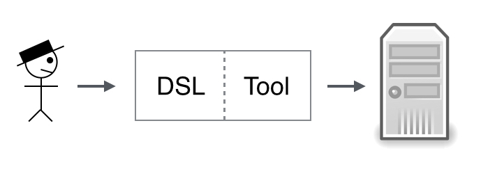
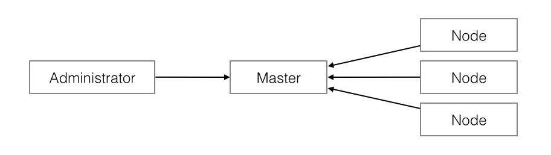
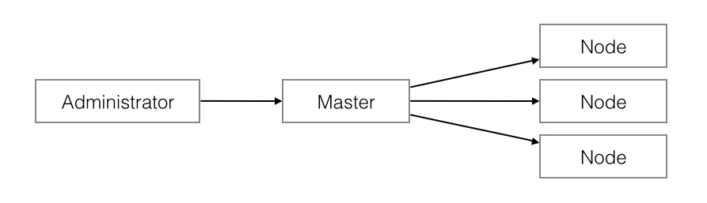
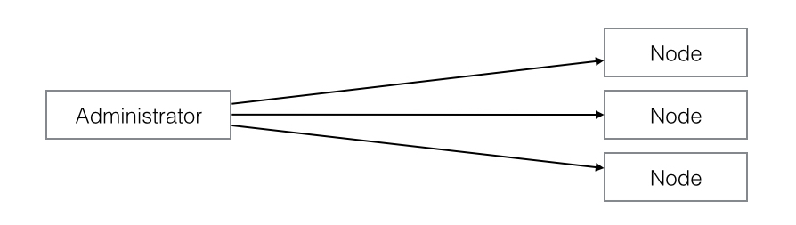

# Choosing a provisioning framework

So, you have decided that your infrastructure needs automatic provisioning. But which framework should you go for? If you are new to the world of provisioning, it might be hard to know what to look for in a good framework. Here are some considerations you might want to make before you make your final decision.

There are many good provisioning frameworks out there. Among the most mature ones at the moment are [Chef](https://www.chef.io/chef), [Ansible](http://www.ansible.com), [Salt](http://docs.saltstack.com/en/latest/), and [Puppet](http://puppetlabs.com). And there might very well be others worth considering too. So, how do you differentiate between them?

## Two aspects

As we see it, there are two main aspects to consider when evaluating a provisioning framework. 

First we have the part you interact with directly, the DSL. And secondly there is the tool itself, the part which converts what you have described using the DSL into actual infrastructure on your servers.

Lets start by considering the latter.

## The model

When considering the tool, we are actually considering which model is the right one.

There are basically three different models to choose between: *pull*, *push via master*, and *masterless push*. Your specific needs will determine which model is right for you, and in turn which framework you should consider using.

Note that you might also want to mix models. Some people, for instance, use a pull based framework to manage the infrastructure and a different push based framework for application deployment.

Lastly, your choice of a model will affect what software you will have to install where. Some of the models requires you to have a dedicated master node, and some requires you to have some agent pre-installed on the servers. Some requires only an SSH key on the node. Some requires Python or Ruby to run. This is all extra complexity, and you should think about whether you really need it.

### The pull model

If you need your provisioning to really be able to scale, you probably want the pull model. Here the developer uploads the latest changes in configuration to the master provisioning node, which then simply stores it. It is the responsibility of each of your other servers to pull the master regulary and apply any updates. The drawbacks are that you don't control when provisioning is done, and you need an agent pre-installed on the nodes.

The pull model is supported by Puppet and Ansible.

### The push model

A disadvantage of the pull model is that you lose some control of when the changes are applied to your servers. To rectify this, move to a push based model. To still keep a relatively high scalabilty we can keep the master node, and let it push changes to all nodes. This way we get changes out to all servers immediately, and can control the order of things if we wish.

Both Salt and Chef supports push via master.

### The masterless push model

If you don't need high scalability, you might be able to get rid of the master node altogether. This simplifies the model, and allows you to apply changes to your servers directly from your local machine. This might be best suited for smaller teams, as there is no longer a master to mediate changes, and two people provisioning at the same time might cause trouble.

Note that even with the masterless push model, you might vant to keep a dedicated server to provide a stable environment for initiating the provisioning of your production servers.

Ansible is an example of a framework supporting masterless push out of the box.

## The DSL

After determining which model is right for you, you still have to find the best framework supporting this model. Looking at the DSL, there are some questions you should be asking.

- **Is it [idempotent](https://en.wikipedia.org/wiki/Idempotence)?**

 	You will want to describe your ifrastructure in a declarative way. And when running the provisioning code repeatedly, you want the result to be the same on every run. This should be a property of every serious provisioning framework by now, but just in case the one you are considering isn't idempotent: stay away!

- **How readable is it?**

	When you set up automatic provisioning of your servers, what you are really doing is creating a specific documentation over all your servers and environments as code. The easier the DSL is to read, the better your overview is, and less time is wasted checking things.

    This is especially important in a large organization where a lot of different people need to read and understand the code, or in a setting where you frequently need to train new people.

    In the ideal case, the DSL should be so obvious that even non-technical people get something out of reading it.

- **Which abstractions does it provide?**

	Make sure the framework you choose have abstracted away things you don't want to deal with.

	To give an example, you probably want to set up some users on your servers, but you don't want to specify the steps for doing so. You want to describe usernames, groups, and perhaps which shell they prefer, but not the exact commands to invoke to make it so.

	Sometimes you'll probably have to resort to listing some exact command lines to execute, but a good DSL will have predefined tasks for most of the things you need to do.

	One of the most important abstractions is the ability to detect state changes in e.g. configuration files and deciding what to do based on that. You should not restart services "just in case". Instead you should be able to state something like: "if `X` has *changed*, *reload* service `Y`".

- **Does it separate your data from your logic?**

	Separating the logic and the data from the provisioning have several benefits. 

	For one thing, extracting things out into variables and pure datastructures can help keeping your code [DRY](https://en.wikipedia.org/wiki/Don't_repeat_yourself). When the logic is no longer tied to a specific set of values, and you might be able to reuse it more easily. You know that code you were planning to write to set up a reverse proxy? Now you can reuse it when you need a different proxy.

	Having your data independent of the DSL of the framework will also prove very useful the day you choose to change frameworks, as the datastructures will be easily reusable, while you have to throw away the framework specific logic.

	And finally, no matter how nice and readable the DSL is, it can't beat pure datastructures. 

Some of these questions might be more or less important depending on your situation. For instance, readability is very important if many new people will need to involve themselves in provisioning, but less so if you have a small core team with low turnover responsible. Make sure the questions  important to you have good answers.

## Conclusions

Which provisioning framework should you choose? The answer is, as always, *it depends*. We have presented some of the major points on which you should judge a framework, but it's up to you to make a decision suited to your needs. Remember to consider the model you'll need before looking at the DSL, as the model is most likely to be a constraint.

This article has, quite possibly, left you even more unsure about which framework to choose. But at least now you know which questions to ask.

